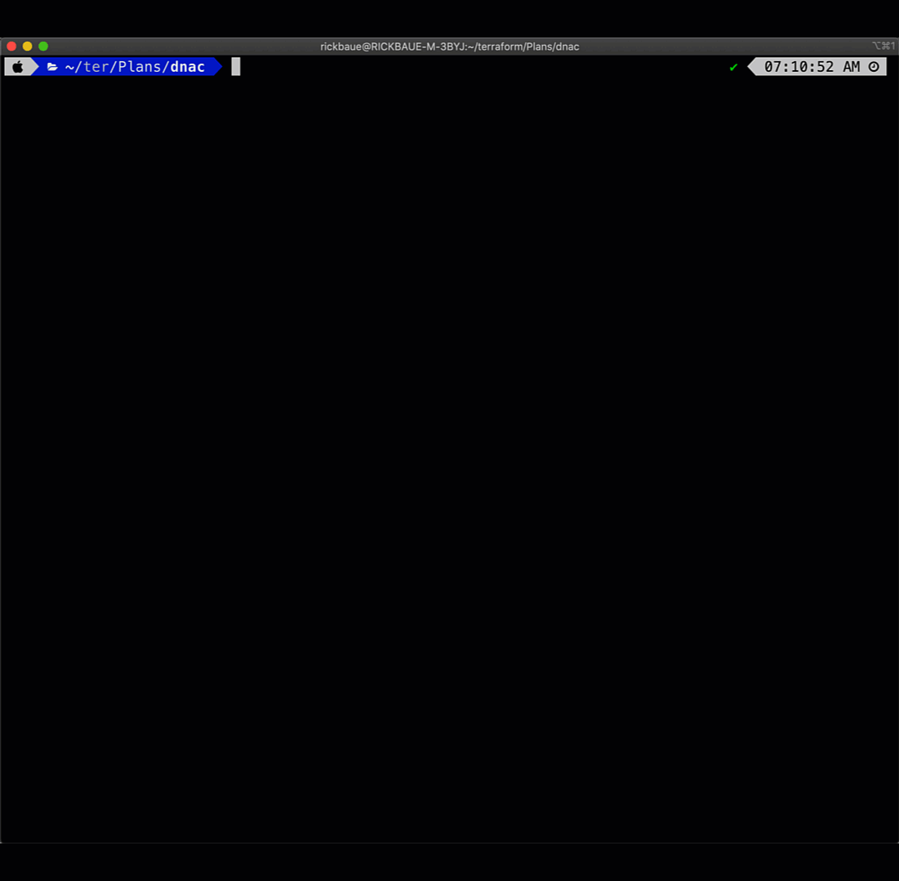
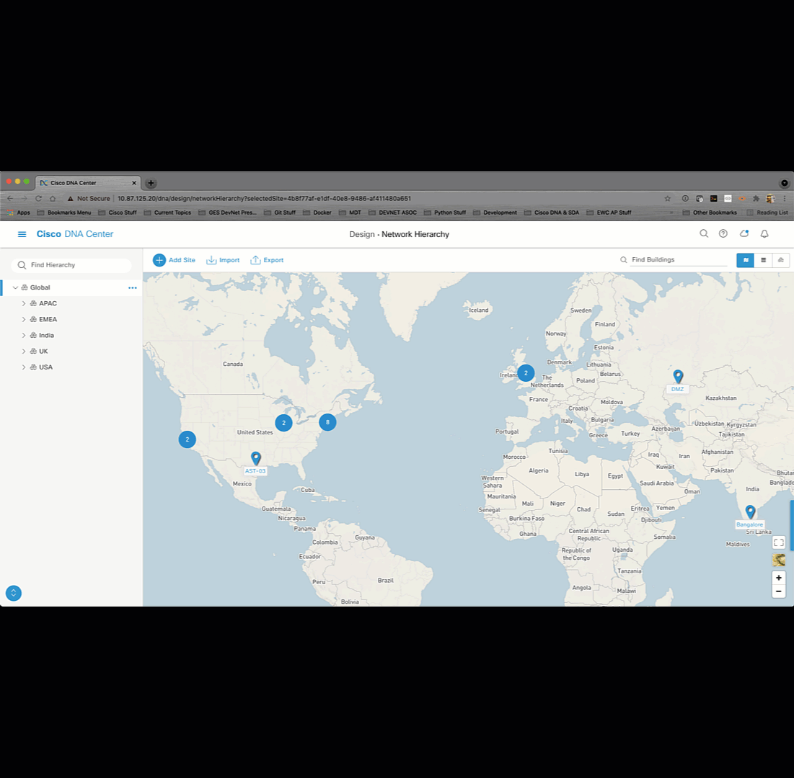
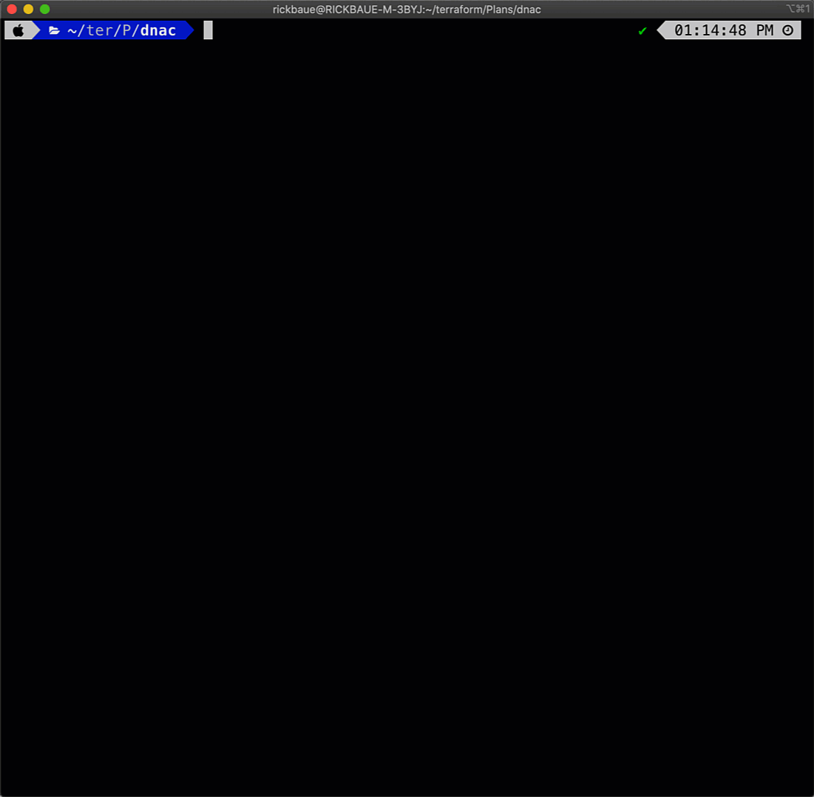

# Cisco DNA Center with Terraform Infrastructure as Code (IaC)
Terraform is an open-source infrastructure as code software tool that provides a consistent CLI workflow to manage hundreds of cloud services. Terraform codifies cloud APIs into declarative configuration files. Terraform allows infrastructure to be expressed as code in a simple, human readable language called HCL (HashiCorp Configuration Language). It reads configuration files and provides an execution plan of changes, which can be reviewed for safety and then applied and provisioned.

Extensible providers allow Terraform to manage a broad range of resources, including IaaS, PaaS, SaaS, and hardware services.

There is tremendous potential using Terraform with Cisco DNA Center to improve your configuration quality and to improve your adoption of the controller. Being able to define how your infrastructure will be designed and configured programmatically not only saves time but it also improves the overall hygiene through consistency. 

# What are we going to do?
In this lab we will explore how Terraform can be used to design and configure Cisco DNA Center site hierarchy to accelerate your Cisco DNA Center adoption. 

Description:

This sample application was developed with the DNA Center Provider for Terrafrom and requires Cisco DNA Center. The workflow creates the DNA Center site hierarchy (site, building, and floor) using Infrastructure as Code (IaC) tooling for design acceleration and consistency.

The Challenge:

• Day0 DNA Center Design configuration 

• Optimize DNA Center Site Hierarchy process 

• Reduce DNA Center adoption time

The Goal:

• Automate the workflow to define and configure DNA Center site hierarchy declaratively so that no Network Engineer time is required.

The Solution:

• Use DNA Center Terraform provider to facilitate the declarative configuration of Cisco DNA Center.

The Results:

• Expedite DNA Center deployments 

• Increased accuracy and site design standardization

Business Summary:

Simplify the Site creation with automation tooling based on Terraform and Cisco DNA Center REST APIs.

# Some terms to understand

Declarative vs. Imperative (Procedural)

•	Declarative configuration is the description of the how the system should look or operate

•	Imperative configuration is the configuration steps in sequence to make the system operate

Immutable vs. Mutable

•	Immutable – not to be changed, so rather than modifying the configuration the entire component is replaced which makes it more reproducible and eliminate configuration drift (Snowflakes)

•	Mutable – the configuration can be modified so there is the risk of drift and configuration control must be addressed to ensure all components are configured the same

# Why Terraform and not something else?
Tools like Ansible, Puppet, Chef, and SaltStack are configuration management tools, that are used to install and manage software on existing servers. 

Terraform is a provisioning tool, that you would use it to provision the servers as well as the rest of your infrastructure (load balancers, databases, network infrastructure, etc) where the configuration would be done with another tool.

# Terraform vs. Ansible

# What are the parts of Terraform?

•	The binary (terraform)

•	The config (main.tf)

•	The provider which tells Terraform how to interact with your infrastructure (defined in main.tf and Initialized w/ terraform init)

•	The plan (YourPlanName.tf) how you want your infrastructure to look

# Getting Started
The four steps that we will investigate in the lab are;

•	Installing Terraform

• Adding the provider for the Cisco DNA Center - Init

•	Testing the Plan - Plan

•	Applying the Plan - Apply

•	Removing the Plan - Destroy

# Installing Terraform

Terraform is supported across Windows, Linux/Unix and MacOS. The downloads for the latest version can be found [here](https://www.terraform.io/downloads.html) or installed with the popular package managers. Terraform is distributed as a single binary. To install Terraform unzip the binary and move it to a directory and add the binary’s location to your PATH. On Linux and MacOS systems you can do this through the command `$PATH`. 

HashiCorp has robust documentation, here is the link to the Terraform Install Guide

Execute the `terraform` command in the shell to verify the install. This is the equivalent of output from the `terraform -help` command.

To run the lab you will need an instance of Cisco DNA Center and Terraform installed on your workstation or development platform. You can use your own Cisco DNA Center or you can use the [dCloud Sandbox](https://dcloud2-rtp.cisco.com/content/demo/759521?returnPathTitleKey=content-view)

# Terraform Init 

This is the process `terraform init` of adding a Provider to be used with different integrations in Terraform. Terraform has a registry of providers that you can use for your IaC projects [Terraform Registry](https://registry.terraform.io/browse/providers). The Cisco DNA Center provider can be found [here](https://registry.terraform.io/providers/cisco-en-programmability/dnacenter/latest) along with sample code to build your plans and documentation for the resources and data sources found in the provider.

# Terraform Plan and Apply

The `terraform plan` command is a preflight test of what you are declaring in your configuration and `terraform apply` to apply the declared configuration to your infrastructure. 

# Terraform Destroy 

Just in name terraform destroy is my favorite. This option allows you to undo the configuration defined in your plan and restore the infrastructure to its preexisting state. 

# License
This project is licensed to you under the terms of the [Cisco Sample Code License](LICENSE).
